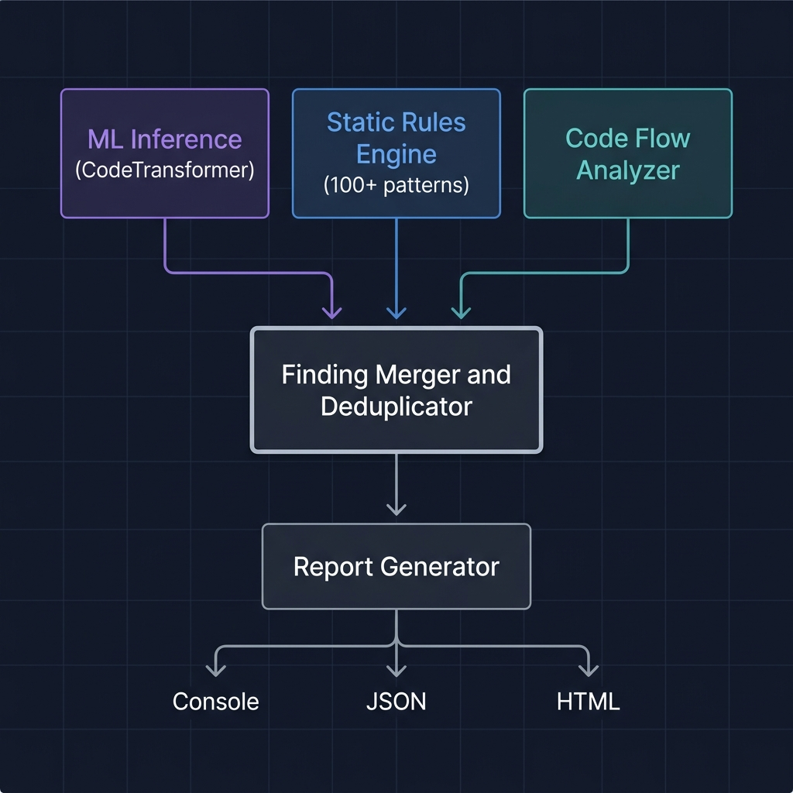

<div align="center">


<br/>

**A transformer-based deep learning system for detecting security vulnerabilities in source code.**

BAYREUTHWING combines a custom 25M-parameter CodeTransformer neural network with 100+ static analysis rules and code flow analysis to deliver high-confidence, multi-language vulnerability detection mapped to OWASP Top 10 and CWE standards.

<br/>

[](https://python.org)
[](https://pytorch.org)
[](LICENSE)
[](https://owasp.org/Top10/)

</div>

---

<!-- GitHub Topics: ai, security, vulnerability-scanner, code-analysis, pytorch, transformer, owasp, cwe, sast, static-analysis, deep-learning, cybersecurity, code-security, machine-learning, defensive-security -->

## Table of Contents

- [Overview](#overview)
- [Key Capabilities](#key-capabilities)
- [Vulnerability Coverage](#vulnerability-coverage)
- [Architecture](#architecture)
- [Project Structure](#project-structure)
- [Installation](#installation)
- [Usage](#usage)
- [Internet Intelligence](#internet-intelligence)
- [Admin Controls](#admin-controls)
- [Report Formats](#report-formats)
- [Configuration](#configuration)
- [Testing](#testing)
- [Disclaimer](#disclaimer)

---

## Overview

BAYREUTHWING addresses a critical gap in application security: most static analysis tools rely solely on pattern matching, which misses complex vulnerability patterns. By combining deep learning inference with traditional static analysis and data flow tracking, BAYREUTHWING achieves higher detection confidence while minimizing false positives.

The system operates as a **multi-agent architecture** where three specialized analysis modules collaborate:

1. **ML Inference** — A custom CodeTransformer model trained on vulnerability patterns
2. **Static Rules** — 100+ curated regex rules for known vulnerability signatures
3. **Code Flow Analysis** — Taint tracking, dangerous function detection, and missing security controls

When multiple modules independently identify the same vulnerability, confidence scores are boosted, producing more reliable results.

---

## Key Capabilities

### CodeTransformer Model

| Parameter         | Value            |
|-------------------|------------------|
| Parameters        | ~25 million      |
| Encoder Layers    | 6                |
| Attention Heads   | 8                |
| Embedding Dim     | 512              |
| Max Sequence      | 2,048 tokens     |
| Vocabulary        | 32,000 tokens    |
| Output            | 11-class multi-label with calibrated confidence |

The model uses a **Vulnerability Attention** mechanism — a specialized cross-attention layer with learned query vectors for each vulnerability class. This allows the model to develop class-specific attention patterns, focusing on different code regions for different vulnerability types (e.g., attending to string operations for SQL injection, attending to crypto calls for weak cryptography).

### Language and Framework Support

**Languages:** Python, JavaScript/TypeScript, Java, C, C++, PHP, Ruby, Go, Rust

**Frameworks (auto-detected):** Django, Flask, FastAPI, Express, React, Spring Boot, Rails, Laravel, Gin, Actix-Web

The scanner adapts its analysis strategy based on detected framework — for example, checking for CSRF protection in Django, helmet middleware in Express, or prepared statements in Spring Data.

### Training Pipeline

- Synthetic data generator producing 5,000+ labeled vulnerable/safe code pairs
- Mixed-precision training (AMP) with gradient scaling
- Cosine warmup learning rate scheduling
- Early stopping with best-model checkpointing
- Per-class precision, recall, F1-score, and ROC-AUC evaluation

### Internet-Connected Threat Intelligence

- **NVD/CVE Lookup** — Real-time queries to the NIST National Vulnerability Database for CVE enrichment
- **Dependency Scanning** — Checks project packages against Google's OSV.dev vulnerability database
- **GitHub Repository Scanning** — Clones and scans public repos by URL with advisory integration
- **CISA KEV Integration** — Cross-references findings with the Known Exploited Vulnerabilities catalog

All internet features use public APIs with no authentication required. Optional API keys enable higher rate limits.

---

## Vulnerability Coverage

All findings map to CWE identifiers and OWASP Top 10 (2021) categories.

| ID | Vulnerability             | CWE      | OWASP Category                      | Base Severity |
|----|---------------------------|----------|--------------------------------------|---------------|
| 0  | SQL Injection             | CWE-89   | A03:2021 Injection                   | Critical      |
| 1  | Cross-Site Scripting      | CWE-79   | A03:2021 Injection                   | High          |
| 2  | Command Injection         | CWE-78   | A03:2021 Injection                   | Critical      |
| 3  | Path Traversal            | CWE-22   | A01:2021 Broken Access Control       | High          |
| 4  | Hardcoded Credentials     | CWE-798  | A07:2021 Auth Failures               | High          |
| 5  | Insecure Deserialization  | CWE-502  | A08:2021 Integrity Failures          | Critical      |
| 6  | Weak Cryptography         | CWE-327  | A02:2021 Cryptographic Failures      | Medium        |
| 7  | Buffer Overflow           | CWE-120  | A06:2021 Vulnerable Components       | Critical      |
| 8  | Server-Side Request Forgery | CWE-918 | A10:2021 SSRF                       | High          |
| 9  | Sensitive Data Exposure   | CWE-200  | A02:2021 Cryptographic Failures      | High          |
| 10 | Insecure Randomness       | CWE-330  | A02:2021 Cryptographic Failures      | Medium        |

Each finding includes detailed remediation guidance with secure code examples.

---

## Architecture

<div align="center">

</div>

<br/>

```
                         +---------------------------+
                         |    CLI / API Interface     |
                         |   (Click + Rich console)   |
                         +-------------+-------------+
                                       |
                    +------------------+------------------+
                    |                  |                  |
          +---------v-------+  +-------v--------+  +-----v----------+
          |  ML Inference   |  | Static Rules   |  | Code Flow      |
          |  Module         |  | Module         |  | Module         |
          |                 |  |                |  |                |
          | CodeTransformer |  | 100+ regex     |  | Taint analysis |
          | 25M params      |  | patterns per   |  | Import analysis|
          | Multi-label     |  | vuln class     |  | Missing controls|
          +---------+-------+  +-------+--------+  +-----+----------+
                    |                  |                  |
                    +------------------+------------------+
                                       |
                         +-------------v-------------+
                         |   Finding Merger &        |
                         |   Deduplicator            |
                         |                           |
                         |   Cross-source confidence |
                         |   boosting (1.3x when     |
                         |   modules agree)          |
                         +-------------+-------------+
                                       |
                         +-------------v-------------+
                         |   Report Generator        |
                         |                           |
                         |   Console | JSON | HTML   |
                         +---------------------------+
```

---

## Project Structure

```
BAYREUTHWING/
|
|-- cli.py                        Command-line interface with admin controls
|-- setup.py                      Package installation configuration
|-- requirements.txt              Python dependencies
|-- README.md
|
|-- config/
|   +-- model_config.yaml         Centralized configuration for model, training, scanner
|
|-- src/
|   |-- model/                    [Neural Network]
|   |   |-- transformer.py        CodeTransformer — 6-layer encoder + vuln attention + classifier
|   |   |-- attention.py          Multi-head self-attention + vulnerability cross-attention
|   |   |-- embeddings.py         Token embeddings + sinusoidal positional + token-type embeddings
|   |   +-- tokenizer.py          Code-aware BPE tokenizer with 32K vocabulary
|   |
|   |-- data/                     [Data Pipeline]
|   |   |-- generator.py          Synthetic vulnerable/safe code pair generator
|   |   |-- dataset.py            PyTorch Dataset with class weighting and train/val/test split
|   |   +-- preprocessor.py       Code normalization, language detection, chunking
|   |
|   |-- training/                 [Training System]
|   |   |-- trainer.py            Training loop — AMP, gradient clipping, early stopping
|   |   |-- evaluator.py          Per-class P/R/F1, macro/micro averages, ROC-AUC
|   |   +-- scheduler.py          Cosine annealing with linear warmup
|   |
|   |-- scanner/                  [Scanning Engine]
|   |   |-- engine.py             Multi-agent hybrid orchestrator with finding merger
|   |   |-- rules.py              100+ static vulnerability detection rules
|   |   |-- analyzer.py           Code flow analysis — taint tracking, framework checks
|   |   +-- reporter.py           Console, JSON, and HTML report generation
|   |
|   |-- intel/                    [Internet Intelligence]
|   |   |-- cve_client.py         NVD/CVE API client with caching and rate limiting
|   |   |-- dependency_checker.py OSV.dev package vulnerability checker
|   |   |-- github_scanner.py     Remote GitHub repo clone-and-scan
|   |   +-- threat_feed.py        CISA KEV + OSV.dev threat aggregation
|   |
|   +-- utils/
|       |-- cwe_mapping.py        CWE/OWASP vulnerability database with remediation
|       |-- logger.py             Structured logging with severity formatting
|       +-- helpers.py            File discovery, language detection, code context extraction
|
|-- tests/
|   |-- test_model.py             Model architecture and tokenizer tests
|   |-- test_scanner.py           Scanner engine, rules, and report tests
|   +-- sample_targets/           Intentionally vulnerable test code
|       |-- vuln_python.py        Python vulnerabilities (SQLi, RCE, pickle, MD5, etc.)
|       |-- vuln_javascript.js    JavaScript vulnerabilities (XSS, exec, Math.random, etc.)
|       +-- vuln_java.java        Java vulnerabilities (Statement, Runtime.exec, etc.)
|
+-- docs/
    +-- images/
        |-- banner.png
        +-- architecture.png
```

---

## Installation

**Prerequisites:** Python 3.9+ and pip.

```bash
# Clone the repository
git clone https://github.com/your-username/bayreuthwing.git
cd bayreuthwing

# Install dependencies
pip install -r requirements.txt
```

For CPU-only PyTorch (recommended if no GPU):

```bash
pip install torch --index-url https://download.pytorch.org/whl/cpu
```

---

## Usage

### Scan Code for Vulnerabilities

```bash
# Scan a single file
python cli.py scan path/to/file.py

# Scan an entire project directory
python cli.py scan ./my-project/ --recursive

# Generate an HTML report
python cli.py scan ./my-project/ --format html --output report.html

# Generate a JSON report for CI/CD integration
python cli.py scan ./my-project/ --format json --output results.json

# Scan with a trained ML model
python cli.py scan ./my-project/ --model checkpoints/model_best.pt
```

### Train the CodeTransformer Model

```bash
# Default: 50 epochs, 5000 synthetic samples, batch size 32
python cli.py train

# Custom parameters
python cli.py train --epochs 100 --batch-size 64 --samples 10000 --lr 0.0001
```

### Run the Demo

Scans built-in intentionally vulnerable code to demonstrate detection capabilities:

```bash
python cli.py demo
```

### View System Information

```bash
python cli.py info
```

---

## Internet Intelligence

BAYREUTHWING connects to public security databases for real-time threat intelligence. All internet features work without authentication, though API keys can be provided for higher rate limits.

### Scan a GitHub Repository by URL

```bash
# Clone and scan a public repo
python cli.py github-scan https://github.com/owner/repo

# Scan a specific branch with HTML report
python cli.py github-scan https://github.com/owner/repo --branch develop --format html --output report.html

# Keep the cloned repo after scanning
python cli.py github-scan https://github.com/owner/repo --keep
```

This command clones the repository, runs the full code scan, checks dependencies against OSV.dev, and fetches any GitHub Security Advisories.

### Check Dependencies for Known Vulnerabilities

```bash
# Scan project dependencies (requirements.txt, package.json, go.mod, etc.)
python cli.py deps ./my-project/

# JSON output for automation
python cli.py deps ./my-project/ --format json --output dep-report.json
```

Supported dependency files: `requirements.txt`, `Pipfile`, `pyproject.toml`, `package.json`, `go.mod`, `Cargo.toml`, `Gemfile`, `composer.json`.

Data source: [OSV.dev](https://osv.dev/) by Google, which aggregates PyPI, npm, Go, RustSec, and GitHub Advisory databases.

### Search the NVD for CVEs

```bash
# Search by keyword
python cli.py cve-search "sql injection python"

# Look up a specific CVE
python cli.py cve-search CVE-2021-44228

# Search by CWE ID
python cli.py cve-search CWE-89 --cwe

# Filter by severity
python cli.py cve-search "deserialization" --severity CRITICAL --max-results 5
```

Data source: [NIST National Vulnerability Database (NVD)](https://nvd.nist.gov/) API v2.0.

### View Threat Intelligence

```bash
# View CISA KEV threat landscape summary
python cli.py threats

# Check if a CVE is actively exploited
python cli.py threats --check-cve CVE-2021-44228

# Search the KEV catalog
python cli.py threats --search "apache"
```

Data source: [CISA Known Exploited Vulnerabilities](https://www.cisa.gov/known-exploited-vulnerabilities-catalog) catalog. CVEs in this list are confirmed to be actively exploited in the wild and should be treated as maximum priority.

### Data Sources

| Source | Description | Auth Required |
|--------|-------------|---------------|
| NIST NVD | National Vulnerability Database — CVE details, CVSS scores | No (key optional) |
| OSV.dev | Google's open-source vulnerability database | No |
| GitHub API | Repository metadata, security advisories | No (token optional) |
| CISA KEV | Known Exploited Vulnerabilities catalog | No |

---

## Admin Controls

Fine-grained control over the scanning engine via CLI flags:

| Flag            | Effect                                    |
|-----------------|-------------------------------------------|
| `--no-ml`       | Disable ML inference (rules-only mode)    |
| `--no-rules`    | Disable static rules (ML-only mode)       |
| `--no-flow`     | Disable code flow analysis                |
| `--threshold N` | Set confidence threshold (default: 0.5)   |
| `--model PATH`  | Load a specific model checkpoint          |
| `--format FMT`  | Output format: `console`, `json`, `html`  |
| `--output PATH` | Write report to file                      |

Module activation can also be configured in `config/model_config.yaml` under the `scanner.modules` section.

---

## Report Formats

**Console** — Formatted terminal output with severity summary, vulnerability breakdown, and detailed findings with CWE/OWASP mappings and remediation guidance.

**JSON** — Machine-readable structured report. Contains scan metadata, severity counts, and detailed finding objects with confidence scores. Designed for CI/CD pipeline integration and SIEM ingestion.

**HTML** — Styled dark-theme report with severity cards, bar charts, inline code snippets, and actionable remediation steps. Suitable for stakeholder review and compliance documentation.

---

## Configuration

All parameters are centralized in `config/model_config.yaml`:

| Section                | Contents                                                    |
|------------------------|-------------------------------------------------------------|
| `model`                | Architecture: layers, heads, dimensions, vocabulary size    |
| `training`             | Epochs, batch size, LR, warmup, early stopping patience     |
| `scanner`              | Modules, threshold, languages, file size limits             |
| `scanner.adaptive`     | Framework auto-detection and context-aware rule adjustment  |
| `vulnerability_classes`| CWE/OWASP mappings and base severity for each class         |

---

## Testing

```bash
# Full test suite
pytest tests/ -v

# Model tests (tokenizer, embeddings, attention, transformer)
pytest tests/test_model.py -v

# Scanner tests (rules, analyzer, engine, reports)
pytest tests/test_scanner.py -v

# With coverage
pytest tests/ -v --cov=src
```

---

## Exit Codes

For CI/CD integration, the scanner returns meaningful exit codes:

| Code | Meaning                          |
|------|----------------------------------|
| 0    | No vulnerabilities detected      |
| 1    | Non-critical vulnerabilities found |
| 2    | Critical vulnerabilities found   |

---

## Disclaimer

BAYREUTHWING is designed for **defensive security analysis** and **authorized testing environments**. It is intended to help developers, security engineers, and administrators identify and remediate vulnerabilities through responsible analysis. Do not use for unauthorized access or offensive purposes.

---

<div align="center">

**Built with PyTorch. Mapped to OWASP and CWE. Designed for defense.**

</div>
